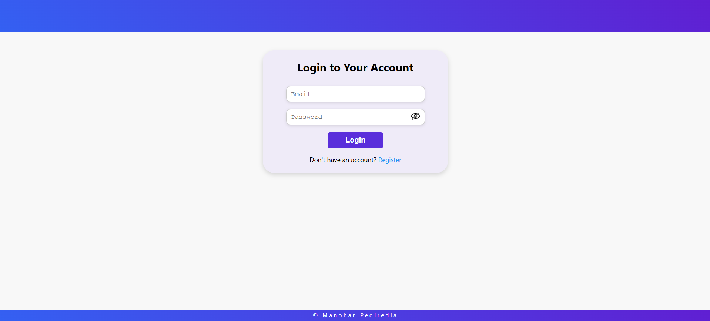
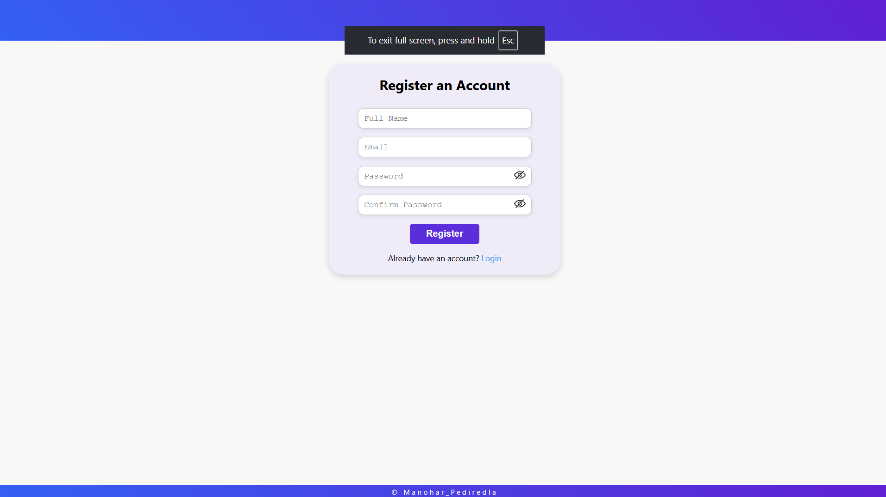

# 🚀 Job Tracker — React Job Application Management System

Job Tracker is a full-featured React-based job application management system that helps users track, filter, sort, and manage their job search efficiently.

It includes authentication, advanced filtering, sorting, and complete CRUD functionality.

---

## 🌐 Live Demo

Frontend: https://jobapplicationchecker.netlify.app  
GitHub Repo: https://github.com/Manohar7730/job-application-checker  

---

## 🛠 Tech Stack

- React.js (Hooks & Functional Components)
- JavaScript (ES6+)
- HTML5
- CSS3
- Vite
- Netlify (Deployment)

---

## ✨ Features

### 🔐 Authentication
- Register with Name, Email, Password
- Confirm Password validation
- Login with Email & Password
- Logout functionality
- Protected dashboard access

### 📊 Dashboard
- View all job applications
- Search by Job Title or Company
- Filter by:
  - Status
  - Applied Date
  - Date Range
- Clear Filters option
- Column Sorting:
  - Job Title
  - Company
  - Status
  - Applied Date
  - Deadline

### ➕ Job Management
- Add new job
- Edit job
- Delete job
- View job details

### 📝 Job Fields
- Job Title
- Company
- Status (Dropdown)
- Applied Date
- Deadline
- Resume Link
- Application Link
- Job Description
- Notes

### ⚡ UX Enhancements
- Loading state while fetching jobs
- Clean reusable components
- Controlled forms
- Component-based architecture

---

## 🧭 How to Use

1. Register with Name, Email, Password
2. Login using credentials
3. Dashboard loads job data
4. Use search box to filter by title/company
5. Use dropdown filters for status & dates
6. Click "Add Job" to create a new entry
7. Click "Go" in actions to view details
8. Edit or Delete job from dashboard
9. Logout when finished

---

## 📁 Project Structure

/src  
  /components  
    JobForm.jsx  
    JobList.jsx  
    JobItem.jsx  
    Loader.jsx  
  /services  
    jobService.js  
  App.jsx  
  main.jsx  
  index.css  

---

## 📸 Screenshots

  
  

---

## 🔧 Quick Local Setup

### Prerequisites
- Node.js 18+
- npm

### Installation

git clone https://github.com/Manohar7730/job-application-checker.git  
cd job-application-checker  
npm install  
npm run dev  

---

## 📦 Build for Production

npm run build  

---

## 🏗 Architecture Notes

- App component maintains global state
- API logic separated in service layer
- Immutable state updates using map & filter
- Controlled form inputs
- Modular reusable UI components

---

## ⚠ Known Limitations (V1)

- Basic authentication (no email verification)
- No role-based access
- No backend persistence if using local storage (if applicable)
- Limited UI animations

---

## 👨‍💻 Author

Manohar Pediredla  
Junior Software Engineer | React Developer  
Email: manoharpediredla2@gmail.com  
LinkedIn: https://linkedin.com/in/manoharpediredla  

---

## ⭐ Why This Project Matters

This project demonstrates:

- Strong React fundamentals
- Authentication workflow
- Advanced filtering & sorting logic
- CRUD application design
- Clean component-based architecture
- Frontend deployment workflow

---

## 📄 License

@Manohar_Pediredla
